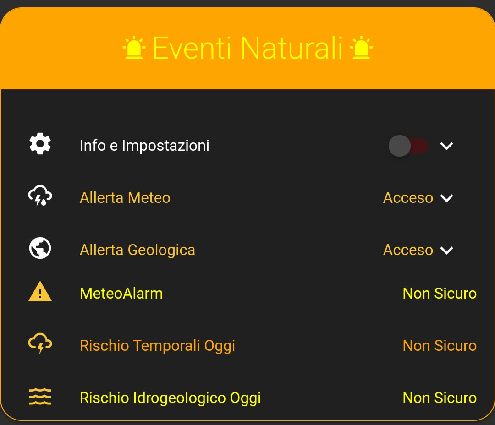
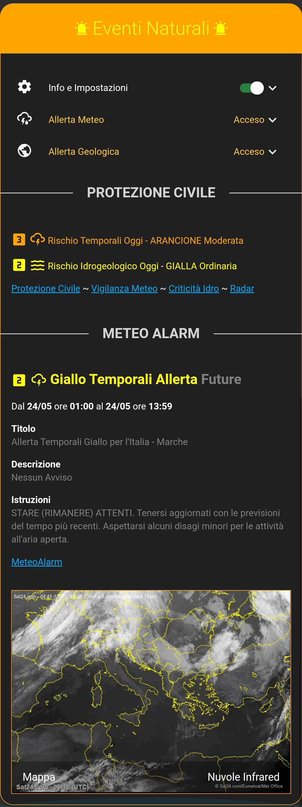

[![hacs][hacsbadge]][hacs] ![hacs_validate] ![Validate with hassfest]

[![GitHub latest release]][githubrelease] ![GitHub Release Date]
[![Maintenancebadge]][Maintenance]
[![GitHub issuesbadge]][GitHub issues]

[![Websitebadge]][website] [![Forum][forumbadge]][forum]
[![telegrambadge]][telegram] [![facebookbadge]][facebook] 


# Home-Assistant-custom-components-DPC-Alert
Italy METEO-HYDRO ALERT

To get more detailed information about parameters of warnings visit [*Civil Protection Department*](http://www.protezionecivile.gov.it/risk-activities/meteo-hydro/activities/prediction-prevention/central-functional-centre-meteo-hydrogeological/meteo-hydro-alert).

**This component will set up the following platforms.**

Platform | Description
-- | --
`binary_sensor` | Show METEO-HYDRO ALERT `on` or `off`.


## Configuration options

| Key | Type | Required | Default | Description |
| --- | --- | --- | --- | --- |
| `name` | `string` | `False` | `dpc` | Name of sensor |
| `istat` | `string` | `True` | None | Number data warehouse I.Stat |
| `alert` | `string` | `False` | GIALLA | (Verde,Gialla,Arancione,Rossa) |
| `warnings` | `list` | `False` | - | List of monitored warnings |

### Possible monitored warnings

| Key | Description |
| --- | --- | 
| `temporali_oggi` | Enables thunderstorms risk monitoring today |
| `idraulico_oggi` | Enables Hydraulic risk monitoring today |
| `idrogeologico_oggi` | Enables Hydrogeological risk monitoring today |
| `temporali_domani` | Enables thunderstorms risk monitoring tomorrow |
| `idraulico_domani` | Enables Hydraulic risk monitoring tomorrow |
| `idrogeologico_domani` | Enables Hydrogeological risk monitoring tomorrow |

## Important

The istat number is required, you can easily find it [here](https://www.paginebianche.it/codice-istat)
or you can download the complete list [here](https://www.istat.it/storage/codici-unita-amministrative/Elenco-codici-statistici-e-denominazioni-delle-unita-territoriali.zip)
If the Istat number starts with zero, it must be entered between the quotes.


## Example usage (minimal)

```
binary_sensor:
  - platform: dpc
    istat: 58091
    warnings:
      - temporali_oggi
```

## Example usage (complete)

```
binary_sensor:
  - platform: dpc
    name: DPC Roma
    istat: '058091'
    alert: 'gialla'
    warnings:
      - temporali_oggi
      - idraulico_oggi
      - idrogeologico_oggi
      - temporali_domani
      - idraulico_domani
      - idrogeologico_domani
```

## Example Lovelace markdown card
```
type: markdown
style: |
  ha-card {background: none; border-radius: 0px; box-shadow: none;}
  .card-content {padding: 0}
content: >
  
  


  <font color= {{color[state_attr(e.entity, 'level')|int]}}>
  <ha-icon icon="{{ 'mdi:numeric-' ~ state_attr(e.entity, 'level')|int ~ '-box'}}" style="width: 36px; height: 36px;"></ha-icon> 
  {{state_attr(e.entity, 'friendly_name')}} - {{state_attr(e.entity, 'allerta')}} {{state_attr(e.entity, 'info')}}</font>
  


  [Protezione Civile](http://www.protezionecivile.it/home) ~ [Vigilanza Meteo](http://www.protezionecivile.gov.it/dettaglio/-/journal_content/56/20182/1131180?refererPlid=42041&controlPanelCategory=current_site.content)
  ~ [Criticità Idro](http://www.protezionecivile.gov.it/attivita-rischi/meteo-idro/attivita/previsione-prevenzione/centro-funzionale-centrale-rischio-meteo-idrogeologico/previsionale/bollettini-criticita/bollettino-odierno) ~ [Radar](http://www.protezionecivile.gov.it/radar-dpc)
```

## Example Lovelace card auto-entities and card-mod
```
type: 'custom:auto-entities'
card:
  type: entities
  show_empty: false
  style: |
    ha-card {background: none; border-radius: 0px; box-shadow: none;}
filter:
  include:
    - entity_id: binary_sensor.dpc*
      state: 'on'
      options:
        entity: this.entity_id
        secondary_info: last-changed
        style: |
          :host {
            --color:
              
              {{color[state_attr(config.entity, 'level')|int]}}
            color: var(--color);
            --paper-item-icon-color: var(--color);
          }
```

## Example Automation
```
  - id: natural_events_protezione_civile_notifications
    alias: natural_events_protezione_civile_notifications
    initial_state: true
    trigger:
      platform: state
      entity_id: 
        - binary_sensor.dpc_idrogeologico_oggi
        - binary_sensor.dpc_idraulico_oggi
        - binary_sensor.dpc_temporali_oggi
        - binary_sensor.dpc_idrogeologico_domani
        - binary_sensor.dpc_idraulico_domani
        - binary_sensor.dpc_temporali_domani
    condition:
      - condition: template
        value_template: "{{ trigger.to_state.state == 'on' and (trigger.from_state.state == 'off' 
          or (trigger.to_state.attributes != trigger.from_state.attributes) and not trigger.to_state.attributes.link)}}"
    action:
      - service: notify.telegram
        data_template:
          title: >-
            *Protezione Civile -
            
            {{ trigger.to_state.attributes.friendly_name }}.
             AGGIORNAMENTO DPC. *
          message: |
            
            Bollettino Protezione Civile
             Aggiornamento bollettino. 
            Rischio {{trigger.to_state.attributes.rischio}}. 
            Allerta {{trigger.to_state.attributes.allerta}} 
            Info {{trigger.to_state.attributes.info}}.

            [Bollettino di criticità]({{trigger.to_state.attributes.link}})
```


## Image ([Online Article])

<p align="center">

<br><br>
Cards: card-mod, auto-entities
<br><br>
</p>


<p align="center">

<br><br>
Cards: card-mod, markdown 
</p>


## License

_Information provided by [*protezionecivilepop.tk*](http://www.protezionecivilepop.tk/) Giovanni Pirrotta's Creative Commons Licenses [*CC-BY-SA 4.0.*](https://creativecommons.org/licenses/by-sa/4.0/)_

_Dati forniti dal servizio protezionecivilepop.tk di Giovanni Pirrotta - Licenza Creative Commons [*CC-BY-SA 4.0.*](https://creativecommons.org/licenses/by-sa/4.0/deed.it)_


## Contributions are welcome!

_Thanks to PiotrMachowski for inspiration._ 


***
[Online Article]: https://hassiohelp.eu/2019/10/06/package-eventi-naturali/

[hacs]: https://github.com/custom-components/hacs
[hacsbadge]: https://img.shields.io/badge/HACS-Default-orange.svg
[hacs_validate]: https://github.com/caiosweet/Home-Assistant-custom-components-DPC-Alert/workflows/Validate%20with%20HACS/badge.svg
[Validate with hassfest]: https://github.com/caiosweet/Home-Assistant-custom-components-DPC-Alert/workflows/Validate%20with%20hassfest/badge.svg

[GitHub latest release]: https://img.shields.io/github/v/release/caiosweet/Home-Assistant-custom-components-DPC-Alert
[githubrelease]: https://github.com/caiosweet/Home-Assistant-custom-components-DPC-Alert/releases
[GitHub Release Date]: https://img.shields.io/github/release-date/caiosweet/Home-Assistant-custom-components-DPC-Alert

[Maintenancebadge]: https://img.shields.io/badge/Maintained%3F-Yes-brightgreen.svg
[Maintenance]: https://github.com/caiosweet/Home-Assistant-custom-components-DPC-Alert/graphs/commit-activity
[GitHub issuesbadge]: https://img.shields.io/github/issues/caiosweet/Home-Assistant-custom-components-DPC-Alert
[GitHub issues]: https://github.com/caiosweet/Home-Assistant-custom-components-DPC-Alert/issues


[website]: https://hassiohelp.eu/
[Websitebadge]: https://img.shields.io/website?down_message=Offline&label=HssioHelp&logoColor=blue&up_message=Online&url=https%3A%2F%2Fhassiohelp.eu

[telegram]: https://t.me/HassioHelp
[telegrambadge]: https://img.shields.io/badge/Chat-Telegram-blue?logo=Telegram

[facebook]: https://www.facebook.com/groups/2062381507393179/
[facebookbadge]: https://img.shields.io/badge/Group-Facebook-blue?logo=Facebook

[forum]: https://forum.hassiohelp.eu/
[forumbadge]: https://img.shields.io/badge/HassioHelp-Forum-blue?logo=data:image/png;base64,iVBORw0KGgoAAAANSUhEUgAAABgAAAAYCAYAAADgdz34AAAAGXRFWHRTb2Z0d2FyZQBBZG9iZSBJbWFnZVJlYWR5ccllPAAAA0ppVFh0WE1MOmNvbS5hZG9iZS54bXAAAAAAADw/eHBhY2tldCBiZWdpbj0i77u/IiBpZD0iVzVNME1wQ2VoaUh6cmVTek5UY3prYzlkIj8%2BIDx4OnhtcG1ldGEgeG1sbnM6eD0iYWRvYmU6bnM6bWV0YS8iIHg6eG1wdGs9IkFkb2JlIFhNUCBDb3JlIDUuNS1jMDIxIDc5LjE1NTc3MiwgMjAxNC8wMS8xMy0xOTo0NDowMCAgICAgICAgIj4gPHJkZjpSREYgeG1sbnM6cmRmPSJodHRwOi8vd3d3LnczLm9yZy8xOTk5LzAyLzIyLXJkZi1zeW50YXgtbnMjIj4gPHJkZjpEZXNjcmlwdGlvbiByZGY6YWJvdXQ9IiIgeG1sbnM6eG1wTU09Imh0dHA6Ly9ucy5hZG9iZS5jb20veGFwLzEuMC9tbS8iIHhtbG5zOnN0UmVmPSJodHRwOi8vbnMuYWRvYmUuY29tL3hhcC8xLjAvc1R5cGUvUmVzb3VyY2VSZWYjIiB4bWxuczp4bXA9Imh0dHA6Ly9ucy5hZG9iZS5jb20veGFwLzEuMC8iIHhtcE1NOkRvY3VtZW50SUQ9InhtcC5kaWQ6ODcxMjY2QzY5RUIzMTFFQUEwREVGQzE4OTI4Njk5NDkiIHhtcE1NOkluc3RhbmNlSUQ9InhtcC5paWQ6ODcxMjY2QzU5RUIzMTFFQUEwREVGQzE4OTI4Njk5NDkiIHhtcDpDcmVhdG9yVG9vbD0iQWRvYmUgUGhvdG9zaG9wIENDIDIwMTQgKFdpbmRvd3MpIj4gPHhtcE1NOkRlcml2ZWRGcm9tIHN0UmVmOmluc3RhbmNlSUQ9ImFkb2JlOmRvY2lkOnBob3Rvc2hvcDo0MWVhZDAwNC05ZWFmLTExZWEtOGY3ZS1mNzQ3Zjc1MjgyNGIiIHN0UmVmOmRvY3VtZW50SUQ9ImFkb2JlOmRvY2lkOnBob3Rvc2hvcDo0MWVhZDAwNC05ZWFmLTExZWEtOGY3ZS1mNzQ3Zjc1MjgyNGIiLz4gPC9yZGY6RGVzY3JpcHRpb24%2BIDwvcmRmOlJERj4gPC94OnhtcG1ldGE%2BIDw/eHBhY2tldCBlbmQ9InIiPz4xQPr3AAADq0lEQVR42rRVW2wMURj%2Bz5lL7V27KG26KIuUEJemdalu3VN3Ei/ipSWUuIV4FB4kHrwo8VLRROJBgkYElZCi4olG4rVoROOSbTa0u7pzO/6Z2Zmd3Z2uevBn/8zsf/7zff/tnKGMMRi/pjM6/j08oKiqCm1tbTA4OAhuoqkS8KKPVjceOcgJngkfnl%2B5JiWH0pQvcfUPhULQ0dEBPp8PDBZZlqGyshLGFKG0fHHr/QfNlxnbjFp7uOcl8VVVj%2BXu9XohkUgY2NRpdJMpc5qWN5971zu7ftsWkSAX2iKLYg3NZ/t6Kxbu2Oi2x4g8IxSKSDR2tLXh2JOn3nAkKv9GAzPtyigS%2BSdV1B3sejhv09lTxTBcCXjRK9buu96%2BZG/7dUYEryK59EXWewNcza7zl%2Br237kpessC4yIITIlGGk88666OtR6VMFKmZhZY9sGsdw1ATgFU1O7et%2Brki56JVUtqsl4kl0CVUjB57vo1Tad7X4Wj9U1S0vRj8HfRSQKVC5auPN7zctqiPTs1Rz2pBV6xcOuq%2BkOPusVAeZWxDg5wl%2Bhz1vW%2BpBFMDIYXt9y%2BF6lr2a6kR7IEmipDeFYsRkVewFcTyAXcBtNMhTxCTTErUxZdu96qLW8varhFsyrnQCQOYNXU8qBp//4TH/jkHZ3UCTXFoncQGKciP1SiN1JDVY2IJwgEjq3jYMVsZgC/HSBw9RnA8CgBjmS3MkdefE638sCV0WGQk9/QXYNRicH%2B7eWwYUGpOT4oq%2Bfq0Upw4SEPVOCLnwOWp5o%2BgskfWEoZe8Qg6CGwcp7XWFVxTc0UYdlMrLmQsP8zVuQcWFNiORFCTSvRQTWQs6W101SRXE7/xiDSBeC5BKywRLx/KqbuA44TYUQS4HHfsLHEcZyhulP32zjEUwL2ACuPt24%2BR0HhnONJBA8IoRlG/4P4/%2B57FTTyC9bUMAQk8OJ9Am69VsHjC2cOJbPaU0iQn4DxrjnSwVwp4eF2XwC63uBVLCchpXgQPAiUUrM8xBwlfeqs%2Bc7JwFn//KHKtAI8IkVejFgIgY8p2etEB7cPDbF32wSE8pwx926XTx6pAcPxxmFlzIo2o/qPy84sb4JTSMb7v3qiGFhJIaAzw1wbkmh8tu4IrqKm4v347V1qmvQGKvjJjEyf7v/pX3GmrGp%2BtT73UDyRHCPLMBDKwUj801dl4P7Fwc8fh0rLwiaBrp2dN2Do%2Bxfb%2Bd%2BE2GwEe%2BEPTYaW1gNQUiKaBP9T/ggwAJik5dEKYSC3AAAAAElFTkSuQmCC
